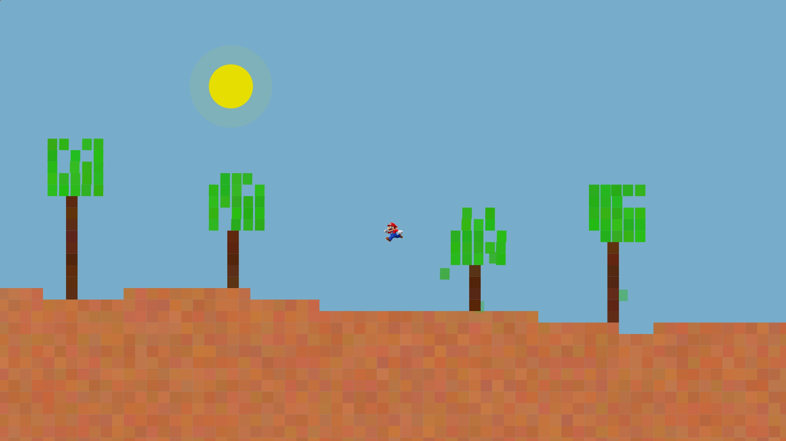

# PEPSE: Precise Environmental Procedural Simulator Extraordinaire

## Overview

PEPSE is a dynamic procedural simulation that emphasizes **procedural generation** and **object-oriented
programming principles**, incorporating modularity and extensibility. The player-controlled avatar explores a
world featuring procedurally generated terrain, realistic foliage animations, and an immersive day-night
cycle. The game adapts dynamically as the avatar interacts with the environment, creating a continuously
evolving experience.

## Table of Contents

1. [Overview](#overview)
2. [Game Description](#game-description)
3. [Key Features](#key-features)
   - [Procedural Generation](#procedural-generation)
   - [Game Mechanics](#game-mechanics)
   - [Animation and Physics](#animation-and-physics)
   - [Component-Based Design](#component-based-design)
   - [Randomization and Reproducibility](#randomization-and-reproducibility)
4. [Code Structure and Key Components](#code-structure-and-key-components)
   - [`pepse`](#pepse)
   - [`pepse.util`](#pepseutil)
   - [`pepse.world`](#pepseworld)
   - [`pepse.world.daynight`](#pepseworlddaynight)
   - [`pepse.world.trees`](#pepseworldtrees)
5. [How to Run](#how-to-run)
   - [Steps to Run](#steps-to-run)
   - [Game Instructions](#game-instructions)
       - [Controls](#controls)
       - [Energy System](#energy-system)

## Game Description

PEPSE offers a procedurally generated world where players control an avatar navigating through ever-changing
landscapes. The simulation features realistic environmental dynamics, including a day-night cycle, interactive
trees with swaying foliage, and an energy system that impacts the avatar's abilities. The game combines
technical sophistication with seamless interactivity, providing a visually immersive and engaging experience.

## Key Features

### Procedural Generation

- **Perlin Noise Terrain**: Ensures natural and continuous terrain elevations that adapt dynamically as the
  avatar moves.
- **Dynamic Trees**: Trees are procedurally generated with randomized trunks and leaf arrangements, offering a
  unique experience with each playthrough. Leaves sway naturally using time-based animations.

### Game Mechanics

- **Energy System**: Energy is consumed only during Power Jumps (special high jumps) and regenerates
  automatically when idle or during normal movement. This adds strategic depth to gameplay.
- **Day-Night Cycle**: Smooth transitions between lighting conditions provide immersive visuals, with gradual
  opacity changes mimicking dawn and dusk.

### Animation and Physics

- **Avatar Animations**: The avatar’s actions (running, jumping, and idling) are animated with sprite swapping
  — cycling through pre-drawn images to create smooth transitions. Directional movement is dynamically
  adjusted using sprite flipping.
- **Leaf and Wind Movements**: Leaves sway realistically with randomized animations, creating a dynamic and
  natural environment.
- **Collision Detection**: Robust collision handling ensures the avatar interacts realistically with terrain
  and tree trunks, while leaves remain passable.

### Component-Based Design

- **Scheduled Tasks**: Manages time-based actions like leaf swaying and day-night transitions efficiently.
- **Transitions**: Enables smooth animations, including leaf movements and lighting changes.
- **Advanced Programming**: Utilizes lambda expressions, method references, and callbacks to achieve dynamic
  interactivity between game elements (e.g., foliage animations triggered by external events).

### Randomization and Reproducibility

- **Seed-Based World Generation**: Ensures consistent procedural worlds across sessions by using seeded random
  generators for terrain and tree placement.

## Code Structure and Key Components

The PEPSE Game is organized into packages, each focused on a specific part of the game. Inside 
each package are classes that handle key features and behaviors:

### `pepse`

- **`PepseGameManager`**: The main entry point, managing game initialization and the simulation environment.

### `pepse.util`

- **`ColorSupplier`**: Generates color variations for visual consistency.
- **`RandomUtils`**: Supports procedural logic with utilities for randomness.
- **`BlockUtils`**: Provides methods for managing terrain block positioning.

### `pepse.world`

- **`Avatar`**: Implements player movement and energy mechanics.
- **`Terrain`**: Handles terrain generation and ground height calculations.
- **`Block`**: Represents static terrain elements with collision handling.
- **`Sky`**: Manages background transitions for the day-night cycle.

### `pepse.world.daynight`

- **`Sun`**: Simulates the sun’s movement.
- **`SunHalo`**: Adds a glowing effect around the sun.
- **`Night`**: Handles nighttime simulation using opacity transitions.

### `pepse.world.trees`

- **`TreeGenerator`**: Procedurally generates trees.
- **`Tree`**: Represents individual trees, managing height and structure.
- **`Leaf`**: Implements leaves with swaying animations and dynamic behaviors.
- **`LeafPositionStatus`**: An enum that tracks leaf states (on tree, falling, or on ground).

## How to Run

### Steps to Run

1. **Ensure Java Installation**: Ensure you have Java installed on your system.
2. **Compile**: Compile the project using any Java-compatible IDE or CLI tools.
3. **Run**: Run the `PepseGameManager` class to start the game.

### Game Instructions

#### Controls
- **Left/Right Arrow**: Move the avatar left or right.
- **Spacebar**: Perform a standard jump.
- **Shift + Spacebar**: Perform a Power Jump, consuming energy.

#### Energy System
- **Energy Consumption**: Energy is depleted only during Power Jumps.
- **Energy Regeneration**: Energy replenishes automatically during idling or normal movement.
- **Disabled Power Jumps**: If energy runs out, Power Jumps are temporarily disabled until sufficient
  energy is regained.
